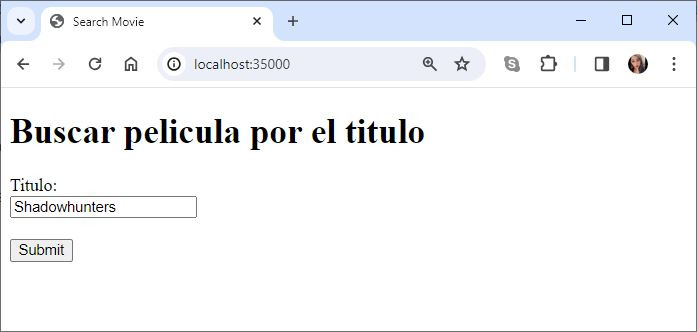
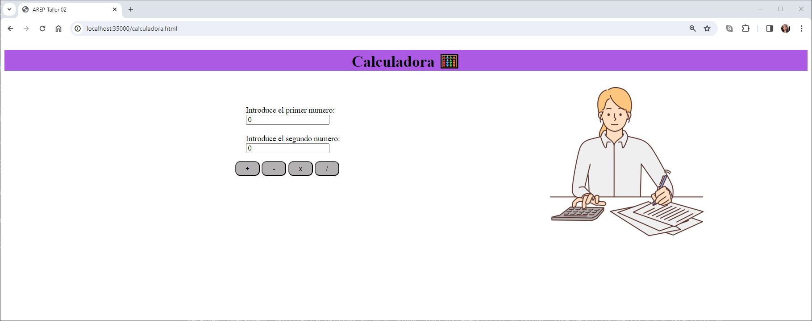
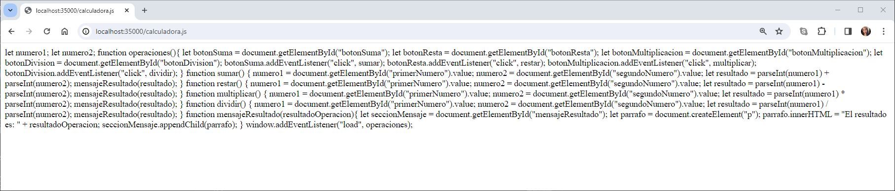
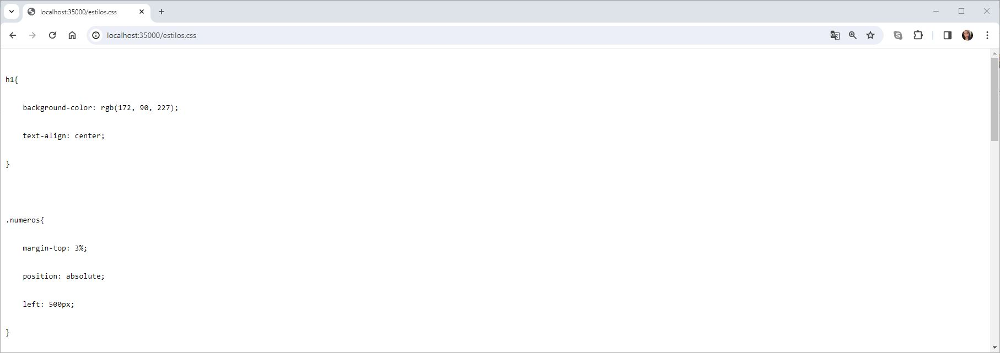
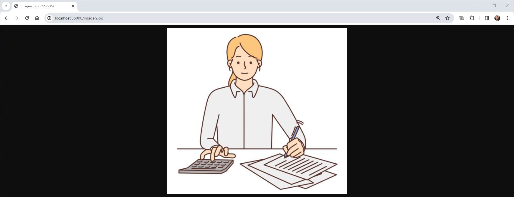
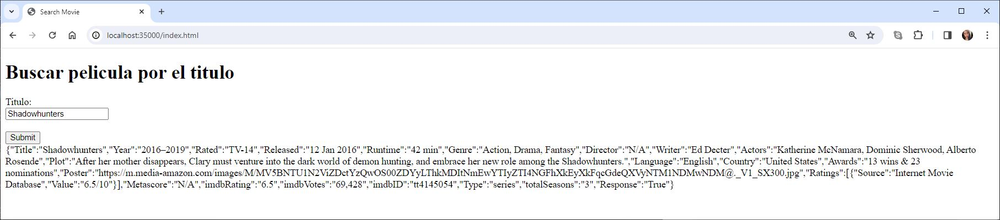
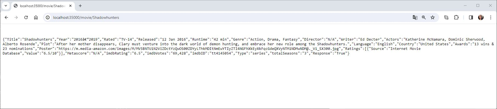

# TALLER 2:  DISEÑO Y ESTRUCTURACIÓN DE APLICACIONES DISTRIBUIDAS EN INTERNET

Se construyo un servidor web que lee archivos HTML, JavaScript, CSS e Imágenes (jpg) del disco local y retorna los archivos solicitados. 

Para probar el servidor se realizó una aplicación de una calculadora sencilla con los archivos mencionados anteriormente. 

Adicional a esto se incluyó el servicio REST que nos permite consultar la información de películas de cine mediante el título de estas del API https://www.omdbapi.com/. Se implemento un Caché para evitar las consultas repetidas al API externo. 


---
### Prerrequisitos

* [Maven](https://maven.apache.org/): Es una herramienta de comprensión y gestión de proyectos de software. Basado en el concepto de modelo de objetos de proyecto (POM), Maven puede gestionar la construcción, los informes y la documentación de un proyecto desde una pieza de información central.

* [Git](https://learn.microsoft.com/es-es/devops/develop/git/what-is-git): Es un sistema de control de versiones distribuido, lo que significa que un clon local del proyecto es un repositorio de control de versiones completo. Estos repositorios locales plenamente funcionales permiten trabajar sin conexión o de forma remota con facilidad.

---

### Instalación

1.Clonamos el repositorio

```
https://github.com/AREP2024-1/AREP_Taller02.git
```

2.Ingresamos a la carpeta del repositorio que clonamos anteriormente

```
cd AREP_Taller02
```

3.Contruimos el proyecto

```
mvn package
```

---

### Ejecución

1.Levantamos el servidor

***Windows:***

```
mvn exec:java -"Dexec.mainClass"="edu.eci.arep.ASE.app.HTTPServer" 
```

***MacOs y Linux:***

```
mvn exec:java -Dexec.mainClass="edu.eci.arep.ASE.app.HTTPServer" 
```

---
### Ejecución de los Casos de Uso

***Probamos nuestra aplicación :***


Para esto accedemos a la siguiente URL en el navegador
```
http://localhost:35000/
```


Como podemos observar en la raíz por defecto nos carga la aplicación del API de películas.

***Trayendo el archivo especificado :***

**1.HTML**

Solicitamos el archivo HTML a través de la siguiente URL:

```
http://localhost:35000/calculadora.html 
```


Este archivo incluye el contenido estructurado de la página web de la calculadora. El llamado al archivo JavaScript, al CSS y adicional a esto contiene una imagen (jpg).

**2.JavaScript**

Solicitamos el archivo JavaScript a través de la siguiente URL:

```
http://localhost:35000/calculadora.js
```


En este archivo se incluyen las instrucciones y el código ejecutable que proporciona la funcionalidad necesaria para llevar a cabo las operaciones fundamentales de la calculadora, mientras presenta los resultados en la interfaz de usuario.

**3.CSS**

Solicitamos el archivo CSS a través de la siguiente URL:

```
http://localhost:35000/estilos.css
```


Este archivo tiene reglas y estilos que definen el aspecto visual y la presentación de los elementos del archivo HTML de la calculadora.

**4.Imagen-(jpg)**

Solicitamos la imagen jpg a través de la siguiente URL:

```
http://localhost:35000/imagen.jpg
```


Imagen de la calculadora.

**5.API**

Solicitamos la aplicación del API, a través de cualquiera de las siguientes URL:

```
http://localhost:35000/
```

```
http://localhost:35000/index.html
```


Este archivo incluye el contenido estructurado de la página web de peliculas. Una función JavaScript y nos devuelve la información de la película con un JSON.

**6.JSON**

Solicitamos el archivo JSON, a través de la siguiente URL, en este caso en especial obtendremos la información de la película Shadowhunters:

```
http://localhost:35000/movie/Shadowhunters
```


Este archivo nos muestra la información de la película especificada.

---

### Construido con

* [Maven](https://maven.apache.org/): Es una herramienta de comprensión y gestión de proyectos de software. Basado en el concepto de modelo de objetos de proyecto (POM), Maven puede gestionar la construcción, los informes y la documentación de un proyecto desde una pieza de información central.

* [Git](https://learn.microsoft.com/es-es/devops/develop/git/what-is-git): Es un sistema de control de versiones distribuido, lo que significa que un clon local del proyecto es un repositorio de control de versiones completo. Estos repositorios locales plenamente funcionales permiten trabajar sin conexión o de forma remota con facilidad.

* [GitHub](https://platzi.com/blog/que-es-github-como-funciona/): Es una plataforma de alojamiento, propiedad de Microsoft, que ofrece a los desarrolladores la posibilidad de crear repositorios de código y guardarlos en la nube de forma segura, usando un sistema de control de versiones llamado Git.

* [Java -17](https://www.cursosaula21.com/que-es-java/): Es un lenguaje de programación y una plataforma informática que nos permite desarrollar aplicaciones de escritorio, servidores, sistemas operativos y aplicaciones para dispositivos móviles, plataformas IoT basadas en la nube, televisores inteligentes, sistemas empresariales, software industrial, etc.

* [JavaScript](https://universidadeuropea.com/blog/que-es-javascript/): Es un lenguaje de programación de scripts que se utiliza fundamentalmente para añadir funcionalidades interactivas y otros contenidos dinámicos a las páginas web.

* [HTML](https://aulacm.com/que-es/html-significado-definicion/): Es un lenguaje de marcado de etiquetas que se utiliza para crear y estructurar contenido en la web. Este lenguaje permite definir la estructura y el contenido de una página web mediante etiquetas y atributos que indican al navegador cómo mostrar la información.

* [CSS](https://www.hostinger.co/tutoriales/que-es-css): Es un lenguaje que se usa para estilizar elementos escritos en un lenguaje de marcado como HTML.

* [Visual Studio Code](https://openwebinars.net/blog/que-es-visual-studio-code-y-que-ventajas-ofrece/): Es un editor de código fuente desarrollado por Microsoft. Es software libre y multiplataforma, está disponible para Windows, GNU/Linux y macOS.


## Autor

* **[Karol Daniela Ladino Ladino](https://www.linkedin.com/in/karol-daniela-ladino-ladino-55164b272/)** - [20042000](https://github.com/20042000)


## Licencia
**©** Karol Daniela Ladino Ladino. Estudiante de Ingeniería de Sistemas de la Escuela Colombiana de Ingeniería Julio Garavito

